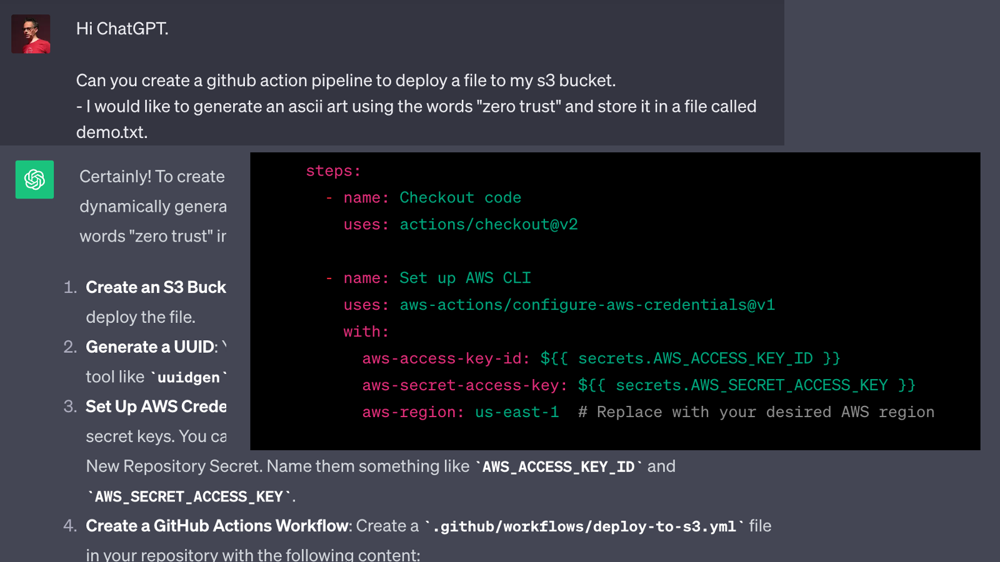
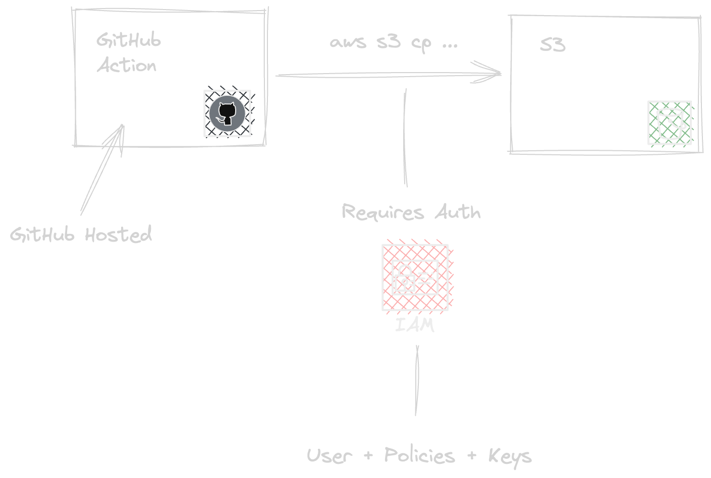
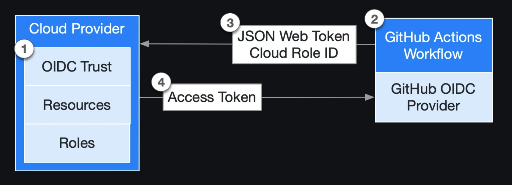

<style scoped>
h1 {
  text-align: center;
  font-size: 80px;
  color: #ffffff;
  text-shadow: 2px 2px 4px #000000;
}

h2 {
  font-size: 40;
  text-align: center;
  color: yellow;
  padding-top: 2.5em;
}

em {
  font-weight: bold;
  font-style: normal;
  color: red;
}

p {
  font-style: italic;
  text-align: center;
  font-size: 40px;

}

strong {
    font-weight: bold;
    color: green;
}
</style>

# Going Passwordless

No More Passwords or Tokens


## Niek Palm


---

# <!-- fit --> Deploying to 
# <!-- fit --> the cloud


---
<!--
_backgroundColor: green
_color: white
-->


# An example

* Upload a file to AWS S3
* Deploy with GitHub Actions
* Create AWS resources to deploy


---



---


# <!-- fit --> Let's build it


---





---
<!--
_backgroundColor: black
_color: lightblue
-->

# <!-- fit --> Wait a minute :thinking:

* Secrets needs to be rotated
* Set expiration date
* What can go wrong?


---


<!--
_backgroundColor: blue
_color: red
-->

# <!-- fit --> :lock: And what about ...

* Access to secrets?
* Access to the secrets in the past?


---
<!--
_backgroundColor: darkred
_color: yellow
-->

# <!-- fit --> :boom: And what about ...

* Committed a secret ...
* Secret leaked via pipeline ...
* Un authorized access to secrets ...


---

<style scoped>
h1 {
  text-align: center;
  font-size: 80px;
  color: white;
  text-shadow: 4px 4px 4px #000000;
}

</style>

# <!-- fit --> Even when we apply best practices
# <!-- fit --> we still have a problem


---
<!--
_backgroundColor: #0e1016
_color: blue
-->

# <!-- fit --> 💡 Avoiding secrets 💡

* Define OIDC trust
* Token injected to the workflow
* Request credentials based on claim
* Temporary credentials provided




---


---

<!--
_backgroundColor: #8345BA
_color: #3D0F58
-->

# GitHub Actiond OIDC for AWS

* Define OIDC provider for GitHub in AWS
* Create role with trust based on *claim*
* Define policies for role


---

<!--
_backgroundColor: #8345BA
_color: #3D0F58
-->

# <!-- fit --> 🚀 Deploy to the cloud


Trust

```json
{
    "Sid": "",
    "Effect": "Allow",
    "Principal": {
        "Federated": "arn:aws:iam::<id>:oidc-provider/token.actions.githubusercontent.com"
    },
    "Action": "sts:AssumeRoleWithWebIdentity",
    "Condition": {
        "StringLike": {
            "token.actions.githubusercontent.com:sub": "<claim>"
        }
    }
}
```

Action

```yaml
jobs:
  permissions:
    id-token: write

  deploy:
    steps:
      - uses: aws-actions/configure-aws-credentials@v4
        with:
          role-to-assume: ${{ inputs.aws_role_to_assume }}
          aws-region: ${{ inputs.aws_region }}
```


---

# Build it

<style scoped>
h1 {
  font-size: 120px;
}
</style>


---
<!--
_backgroundColor: darkred
_color: yellow
-->

# <!-- fit --> 🔥 What can go wrong? 🔥


* No strict claim checks
* Unintended access to workflows


---
<!--
_backgroundColor: purple
_color: white
-->

# <!-- fit --> 🎬 Where do I start? 


* [GitHub](https://docs.github.com/en/actions/deployment/security-hardening-your-deployments/about-security-hardening-with-openid-connect): supports AWS, Azure, GPC, HashiCorp Vault, PyPI
* [GitLab](https://docs.gitlab.com/ee/ci/cloud_services/): supports AWS, Azure, GPC, HashiCorp Vault


---
<!--
_backgroundColor: black
-->

```hcl
# Resources

resource "repo" "demo" {
  url = "github.com/npalm/2023-09-28_devopsdays-meetup-ehv"
}

resource "website" "slides" {
  url = "https://npalm.github.io/2023-09-28_devopsdays-meetup-ehv/"
}

resource "contact" "niek" {
  github   = "@npalm"
  linkedin = "in/niekpalm/"
  twitter  = "@niekos77"
}

```


---
# Questions

<style scoped>
h1 {
  font-size: 120px;
}
</style>


---


<!--
_backgroundColor: #D10077
_color: purple
-->

# <!-- fit --> Thank You
<br>
<br>
<br>


---
